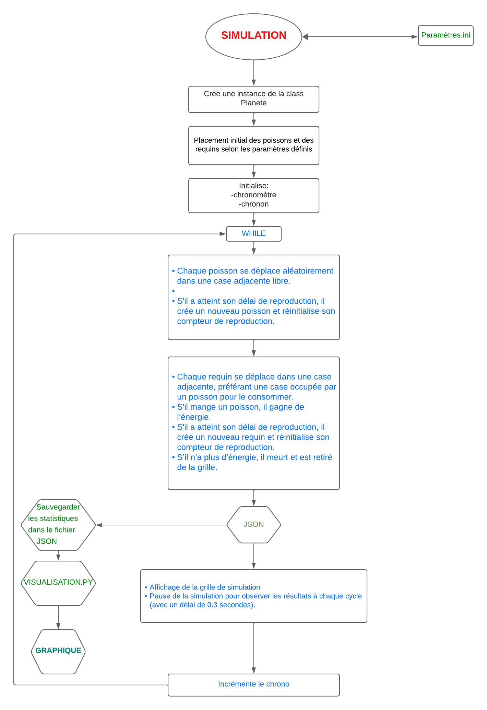
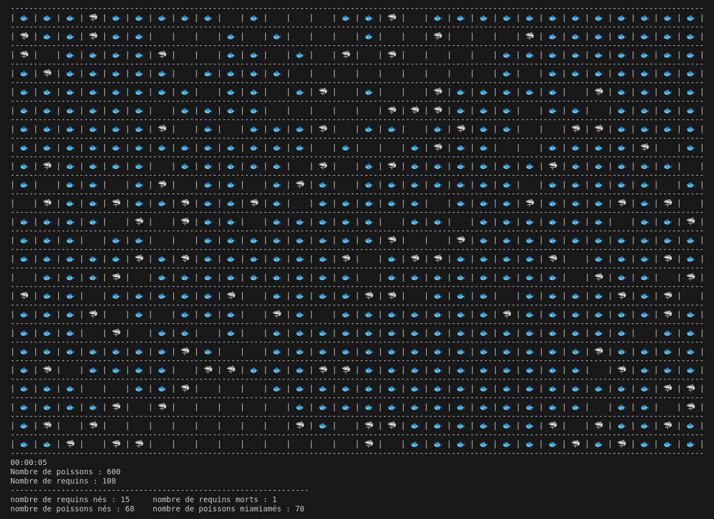
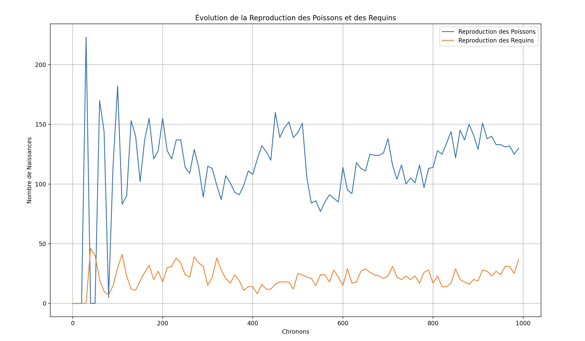

# Simulation Écologique Wa-Tor


## Synopsis
Ce projet implémente une simulation écologique basée sur le modèle Wa-Tor, où deux espèces, les poissons et les requins, évoluent dans un environnement aquatique. Chaque espèce suit des règles spécifiques de déplacement, de reproduction et de survie. Cette simulation permet d'observer les interactions et l'équilibre entre les populations de poissons et de requins dans un écosystème donné.


### Objectif
Ce projet a pour objectif principal de renforcer les compétences en programmation orientée objet (POO) à travers le développement d'une simulation écologique. En travaillant sur ce projet, les développeurs peuvent apprendre à concevoir des classes pour représenter des entités avec des comportements spécifiques, à structurer un code modulaire, et à gérer des interactions dans un environnement simulé. 


###  Installation

1. Clone le dépôt:

```sh
git clone git@github.com:khadmalek/Wa_tor.git
```

## Prérequis
Le projet nécessite Python3 et utilise les modules suivants :
- `configparser` : pour gérer les paramètres de configuration.
- `json` : pour enregistrer les statistiques de reproduction dans un fichier.
- `matplotlib.pyplot` : pour afficher des graphiques de statistiques (optionnel).


```bash
pip install configparser matplotlib
```

## FLOWCHART

Ce flowchart montre les étapes principales de la simulation.


## Structure des fichiers

Chaque fichier du projet a un rôle spécifique pour gérer la simulation :

- [Planete.py](./Planete.py)  :
  Contient la classe `Planete`, qui représente la grille de simulation. Cette classe gère l'affichage de la grille et la gestion des entités (poissons et requins) dans cet espace.

- [Poisson.py](./Poisson.py) : 
  Contient la classe `Poisson`, qui définit les comportements spécifiques aux poissons, notamment les règles de déplacement et de reproduction.

- [Requin.py](./Requin.py) : Contient la classe `Requin`, qui définit les comportements spécifiques aux requins. Les requins ont des règles de déplacement, de reproduction et de gestion de l'énergie, car ils doivent manger des poissons pour survivre.

- [Chronometre.py](./Chronometre.py) :  Gère le temps écoulé dans la simulation, affichant la durée pour chaque étape ou "tour" de simulation.

- [main.py](./main.py)  :
  Fichier principal du projet. Il initialise les paramètres, crée la grille de simulation (l'écosystème) et lance la boucle de simulation. C'est le point de départ pour exécuter le projet.

- [parametre.ini](./parametre.ini) : 
  Fichier de configuration dans lequel sont définis les paramètres de simulation. Ce fichier permet de personnaliser la simulation en ajustant la taille de la grille, le nombre initial de poissons et de requins, et d'autres paramètres importants.

- [reproduction_statistiques.json](./reproduction_statistiques.json) : 
  Fichier de sortie où sont enregistrées les statistiques de reproduction pour chaque chronon (ou tour) de la simulation. Ce fichier permet de suivre les naissances et les décès de chaque espèce au cours de la simulation.

## Utilisation

Une fois les paramètres configurés, exécutez la simulation avec la commande suivante :

```bash
python3 main.py
```

## Sortie

La sortie de la simulation est affichée directement dans la console. Elle comprend :
- La grille de simulation, montrant la position actuelle des poissons et des requins.
- Des statistiques en temps réel, incluant :
  - Le nombre de **poissons nés** et de **requins nés**.
  - Le nombre de **requins morts** (ceux ayant épuisé leur énergie).
  - Le nombre de **poissons mangés** par les requins.

Ces informations sont imprimées dans la console à chaque cycle de simulation, permettant de suivre l'évolution de l'écosystème.

Affichage de la simulation dans la console :



## Génération de Graphiques


Pour visualiser les statistiques de reproduction des poissons et des requins au fil du temps, vous pouvez utiliser le fichier [reproduction_statistiques.json](./reproduction_statistiques.json) pour générer un dictionnaire qui stockera les données sous forme de dictionnaire. 
et executer le fichier [generer_graphique.py](./generer_graphique.py) avec la commande: 

```bash
python3 generer_graphique.py
 ```




## Auteur 


_Auteur : Malek, Raouf, Khadija_.

